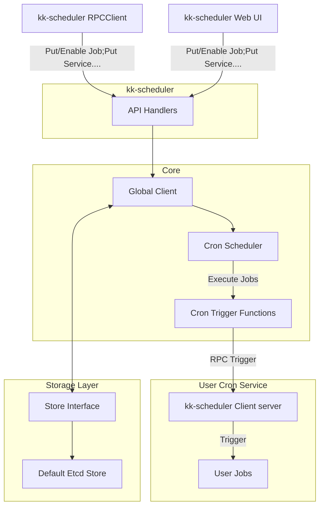

# kk-scheduler

A job scheduling system based on cron and grpc

# Screenshot

[service-list](https://github.com/cruvie/kk-scheduler/blob/main/kk-schedule-server/readme/service-list.png)

[job-list](https://github.com/cruvie/kk-scheduler/blob/main/kk-schedule-server/readme/job-list.png)

# System Design



# Deploy

## Docker

[docker-compose](https://github.com/cruvie/kk-scheduler/tree/main/deploy-docker)

visit http://localhost:8668

# Usage

- install

```shell
go get github.com/cruvie/kk-schedule@latest
```

- Run a grpc server that implemented `kk_schedule.UnimplementedKKScheduleTriggerServer`
  see [client_server_test.go](https://github.com/cruvie/kk-scheduler/blob/main/kk-schedule-server/internal/schedule_test/client_server_test.go)
- Put a service and job into kk-schedule and enable job
  see [readme_test.go](https://github.com/cruvie/kk-scheduler/blob/main/kk-schedule-server/internal/schedule_test/readme_test.go)

# Contribute

## provide more test case

any test case PR is welcome

## support move storge engine

kk-schedule use Etcd as default storage engine, but any storage engine
implement [StoreDriver](https://github.com/cruvie/kk-scheduler/blob/main/kk-schedule-server/internal/schedule/store.go)
can be used

Step1 create a `store_xxxx.go`
like [StoreDriver](https://github.com/cruvie/kk-scheduler/blob/main/kk-schedule-server/internal/schedule/store_etcd.go)

Step2 test it

Step3 add config filed
in [config.go](https://github.com/cruvie/kk-scheduler/blob/main/kk-schedule-server/internal/g_config/config.go)
and [config.yml](https://github.com/cruvie/kk-scheduler/blob/main/kk-schedule-server/config.yml)

## improve readme doc and code comment

## Web UI improve